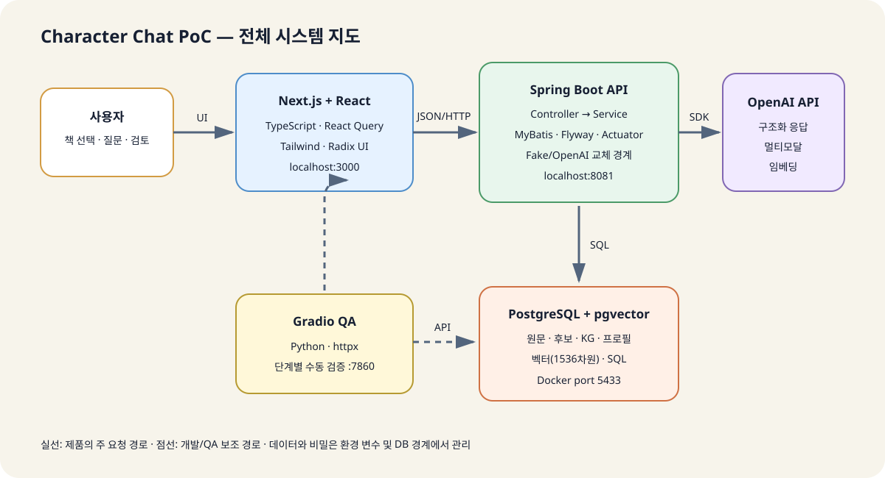
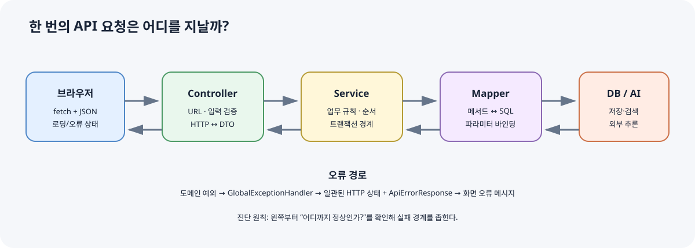
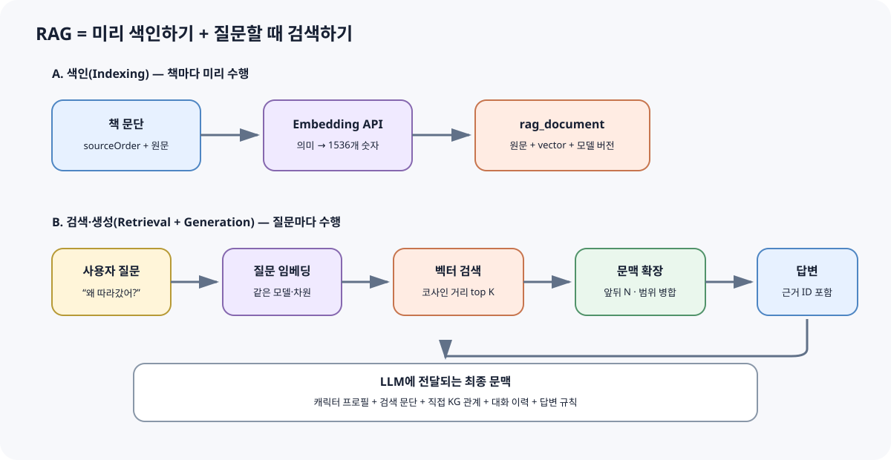
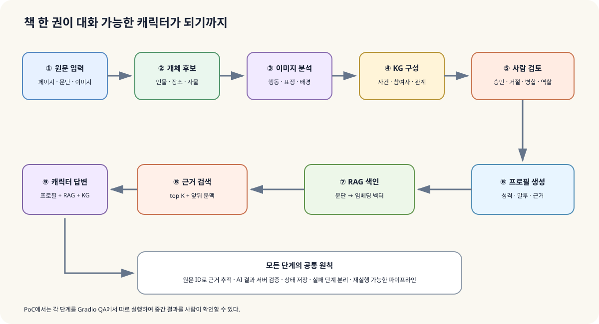

# Character Chat PoC 기술 학습 가이드

> 대상: JavaScript·Java·데이터베이스·AI 용어가 아직 낯선 개발 입문자  
> 목표: 이 저장소를 실행하는 데서 끝나지 않고, **각 기술이 왜 필요하며 코드에서 어떻게 협업하는지** 이해하기



## 1. 이 프로젝트를 한 문장으로 이해하기

이 프로젝트는 책의 텍스트와 이미지를 분석해 등장인물·사건·관계를 데이터로 만들고, 사용자의 질문과 관련된 원문 근거를 검색한 뒤, 선택한 캐릭터의 관점으로 답하는 PoC(Proof of Concept, 가능성 검증용 시제품)입니다.

핵심은 LLM에게 책 전체를 무작정 보내는 것이 아닙니다. 원문과 AI 분석 결과를 구조화해 저장하고, 사람의 검토를 거치며, 질문할 때 필요한 근거만 골라 보내는 방식입니다.

### 사용자 요청이 흐르는 길

| 순서 | 구성 요소 | 하는 일 | 비유 |
|---:|---|---|---|
| 1 | Next.js 화면 | 질문을 받고 결과를 표시 | 안내 데스크 |
| 2 | Spring REST API | 요청을 검증하고 업무 로직 호출 | 접수 창구 |
| 3 | Service | 검색·분석·검토 규칙을 실행 | 담당 실무자 |
| 4 | MyBatis | Java 요청을 SQL로 연결 | 통역사 |
| 5 | PostgreSQL/pgvector | 원문, 관계, 벡터를 저장·검색 | 기록 보관소 |
| 6 | OpenAI API | 구조화 추출, 임베딩, 답변 생성 | 추론 엔진 |

## 2. 기술 지도: 무엇을 어디에 썼나

| 영역 | 프로젝트 기술 | 해결하는 문제 | 실제 위치 |
|---|---|---|---|
| 백엔드 언어 | Java 17 | 타입이 명확한 서버 로직 작성 | `backend/src/main/java` |
| 서버 프레임워크 | Spring Boot 3.5 | HTTP API, DI, 설정, 트랜잭션 | `backend/build.gradle` |
| API 문서 | springdoc OpenAPI/Swagger UI | API를 브라우저에서 탐색·호출 | `application.yml` |
| SQL 매핑 | MyBatis 3 | SQL을 직접 제어하면서 Java 객체와 연결 | `resources/mapper` |
| 관계형 DB | PostgreSQL 17 | 원문과 분석 결과의 일관된 영속 저장 | `compose.yaml` |
| 벡터 검색 | pgvector 0.8 | 의미가 비슷한 문단 검색 | `RagMapper.xml` |
| 스키마 변경 | Flyway | DB 변경 이력을 순서대로 재현 | `db/migration/V*.sql` |
| AI SDK | OpenAI Java 4.43 | 텍스트·이미지·구조화 응답·임베딩 | `ai/openai` |
| 웹 프레임워크 | Next.js 15 + React 19 | 사용자 화면과 개발 서버 프록시 | `frontend/app` |
| 웹 언어 | TypeScript 5.9 | 프런트 데이터 형태를 정적으로 검사 | `frontend/lib/types.ts` |
| 서버 상태 | TanStack Query 5 | 조회 캐시, 로딩·오류, 변경 요청 | `frontend/app/page.tsx` |
| UI | Tailwind CSS, Radix Tabs, Lucide | 스타일, 접근 가능한 탭, 아이콘 | `frontend` |
| QA 도구 | Python + Gradio + httpx | 분석 파이프라인을 단계별 수동 검증 | `qa/app.py` |
| 실행 환경 | Docker Compose | 같은 PostgreSQL 환경 재현 | `compose.yaml` |
| 테스트 | JUnit 5 + Spring Boot Test + MockMvc | API와 서비스 통합 동작 검증 | `backend/src/test` |

### 용어: 라이브러리와 프레임워크

- **라이브러리**는 내 코드가 필요할 때 호출하는 도구입니다. 예: `httpx`, Lucide.
- **프레임워크**는 실행의 큰 흐름을 잡고 내 코드를 적절한 시점에 호출합니다. 예: Spring Boot, Next.js.
- 실제 현장에서는 경계가 완벽히 나뉘지 않습니다. “누가 전체 생명주기를 주도하는가”로 이해하면 충분합니다.

## 3. 백엔드: 계층을 나누는 이유



이 프로젝트의 백엔드는 기능별 패키지(`book`, `chat`, `rag`, `profile` 등) 안에서 다시 역할을 나눕니다. 이를 **관심사 분리**라고 합니다.

| 계층 | 대표 클래스 | 책임 | 넣지 말아야 할 것 |
|---|---|---|---|
| API/Controller | `BookController` | URL·HTTP 메서드·요청/응답 | 복잡한 SQL, 긴 업무 규칙 |
| Application/Service | `BookService`, `ChatService` | 사용 사례 순서와 규칙 | 화면 스타일 |
| Domain | `Book`, `RagDocument` | 핵심 데이터와 의미 | HTTP 상태 코드 |
| Persistence/Mapper | `BookMapper`, XML mapper | DB 읽기·쓰기 | AI 프롬프트 조립 |
| Infrastructure | `OpenAiAiClient` | 외부 서비스 SDK 연결 | 도메인 전체 흐름 |

### 의존성 주입(DI)

`BookService`는 필요한 `BookInputProvider`, `BookMapper`를 직접 `new`로 만들지 않고 생성자로 받습니다. Spring이 구현 객체를 찾아 넣습니다.

```java
public BookService(BookInputProvider inputProvider, BookMapper mapper) {
    this.bookInputProvider = inputProvider;
    this.bookMapper = mapper;
}
```

이 방식의 실무 장점은 실제 OpenAI 대신 `FakeAiClient`를 주입해 빠르고 값싼 테스트를 할 수 있다는 점입니다. 인터페이스(`AiClient`, `EmbeddingClient`)는 외부 기술과 업무 로직 사이의 **교체 가능한 경계**입니다.

### DTO와 도메인 객체

| 용어 | 뜻 | 이 프로젝트의 예 |
|---|---|---|
| DTO | 계층 사이로 전달할 데이터 모양 | `ChatRequest`, `ChatResponse` |
| Domain object | 업무에서 의미가 있는 대상 | `Book`, `CharacterProfile` |
| Entity | DB에서 식별자(ID)를 갖는 대상 | `EntityCandidate`, `StoryEvent` |

API 응답용 DTO를 따로 두면 DB 컬럼을 바꾸더라도 외부 API가 곧바로 깨지는 일을 줄일 수 있습니다.

### 트랜잭션

`@Transactional`은 여러 DB 작업을 하나의 작업 단위로 묶습니다. 책을 저장하다 5페이지에서 실패하면 앞의 4페이지만 남는 대신 전체를 되돌리는 것이 원칙입니다.

| 형태 | 의미 | 사용 예 |
|---|---|---|
| `@Transactional` | 읽기와 쓰기를 한 단위로 처리 | 책 가져오기, 분석 결과 교체 |
| `@Transactional(readOnly = true)` | 조회 의도를 명시하고 최적화 여지 제공 | 책·KG 결과 조회 |
| Writer 분리 | AI 호출과 짧은 DB 쓰기 구간을 분리 | `RagWriter`, `CharacterProfileWriter` |

실무 기법: 느리고 실패 가능성이 큰 외부 API 호출을 DB 트랜잭션 안에 오래 넣으면 연결과 잠금을 불필요하게 점유할 수 있습니다. 이 저장소처럼 계산/AI 호출과 저장 Writer를 분리하면 트랜잭션 경계를 짧게 만들기 쉽습니다.

### 예외를 HTTP 응답으로 바꾸기

`GlobalExceptionHandler`는 여러 예외를 한곳에서 HTTP 상태와 `ApiErrorResponse`로 바꿉니다. 이런 **중앙 집중식 오류 처리**는 모든 Controller의 중복 `try/catch`를 줄이고 응답 형식을 통일합니다.

## 4. REST API와 HTTP 기초

REST는 리소스를 URL로 표현하고 HTTP 메서드로 행동을 구분하는 설계 스타일입니다.

| 예시 | 메서드 | 의미 | 성공 상태의 전형적 예 |
|---|---|---|---|
| `/api/books` | GET | 책 목록 조회 | 200 OK |
| `/api/books/import` | POST | 책 가져오기 실행 | 201 Created |
| `/api/books/{id}/rag/index` | POST | 색인 생성 | 200 OK |
| `/api/books/{id}/character-reviews/{candidateId}` | PUT | 검토 결과 갱신 | 200 OK |
| `/api/books/{id}/chat` | POST | 질문을 보내 답 생성 | 200 OK |

`{id}`는 경로 변수, `?query=...`는 쿼리 파라미터, JSON 본문은 복잡한 입력을 담습니다. Swagger UI(`http://localhost:8081/swagger-ui.html`)는 Controller 선언을 읽어 대화형 API 문서를 만듭니다.

실무 체크리스트:

- Controller 입구에서 필수 입력과 빈 문자열을 검증합니다.
- 내부 예외 메시지나 API 키를 응답으로 노출하지 않습니다.
- HTTP 상태와 오류 JSON 형식을 일관되게 유지합니다.
- API 변경 시 프런트의 TypeScript 타입과 통합 테스트도 함께 갱신합니다.

## 5. 데이터베이스: PostgreSQL, MyBatis, Flyway

### 관계형 데이터 모델

책 한 권은 여러 페이지, 페이지는 여러 문단과 이미지를 가집니다. 테이블 사이의 외래 키(Foreign Key)는 존재하지 않는 책에 문단이 매달리는 것을 막습니다.

| 관계 | 카디널리티 | 의미 |
|---|---|---|
| Book → Page | 1:N | 한 책에 여러 페이지 |
| Page → Paragraph | 1:N | 한 페이지에 여러 문단 |
| EntityCandidate → Mention | 1:N | 한 후보를 여러 원문 표현이 뒷받침 |
| StoryEvent ↔ KnowledgeEntity | N:M | 참여자 연결 테이블을 통한 다대다 |
| CharacterProfile → Evidence | 1:N | 프로필 주장마다 여러 근거 |

### MyBatis

MyBatis는 Mapper 인터페이스 메서드와 XML의 SQL을 연결합니다. ORM처럼 SQL을 완전히 숨기지 않으므로 벡터 연산자 같은 PostgreSQL 기능을 명시적으로 쓰기 좋습니다.

```sql
ORDER BY embedding <=> CAST(#{embedding} AS vector)
LIMIT #{topK}
```

`#{...}`는 값을 바인딩해 문자열 연결보다 SQL Injection 위험을 줄입니다. 다만 테이블명·정렬 컬럼처럼 값 바인딩이 불가능한 부분을 사용자 입력으로 조립하면 여전히 위험합니다.

### Flyway 마이그레이션

`V1__...sql`부터 `V10__...sql`까지 순서가 DB 스키마의 역사입니다. 애플리케이션 시작 시 아직 적용되지 않은 파일만 실행됩니다.

| 좋은 습관 | 이유 |
|---|---|
| 이미 공유된 마이그레이션을 수정하지 않고 새 버전 추가 | 다른 환경의 적용 이력과 checksum 충돌 방지 |
| 데이터 삭제·컬럼 변경 전에 백필 전략 작성 | 배포 중 기존 데이터 보호 |
| 애플리케이션 코드와 스키마의 배포 순서 고려 | 구버전·신버전이 잠시 공존해도 동작 |
| FK, UNIQUE, CHECK를 DB에도 선언 | 애플리케이션 버그가 무결성을 깨는 것 방지 |

### Docker Compose와 볼륨

Compose는 `pgvector/pgvector` 이미지, 포트, 환경 변수, healthcheck, 볼륨을 코드로 기록합니다. 컨테이너를 다시 만들어도 named volume `postgres-data`가 DB 파일을 유지합니다. `docker compose down -v`의 `-v`는 데이터를 지우므로 실무에서는 특히 조심해야 합니다.

## 6. AI 연동: LLM, 멀티모달, 구조화 응답

### 생성형 AI를 일반 함수처럼 감싸기

`AiClient`는 텍스트 생성과 이미지 분석을 인터페이스로 추상화합니다. `AI_PROVIDER=fake`이면 결정적인 가짜 응답, `openai`이면 실제 SDK 구현이 선택됩니다. `@ConditionalOnProperty`가 설정에 따라 Bean을 조건부 등록합니다.

| 방식 | 장점 | 주의점 |
|---|---|---|
| 일반 텍스트 응답 | 자유로운 문장 생성 | 파싱이 불안정 |
| 구조화 응답 | Java 클래스 형태로 결과를 받음 | 스키마를 너무 복잡하게 만들지 않기 |
| 멀티모달 입력 | 이미지와 페이지 문맥을 함께 해석 | 파일 크기, MIME, 비용, 개인정보 |
| Fake 구현 | 빠르고 비용 없는 반복 테스트 | 실제 모델 품질은 보장하지 않음 |

### 프롬프트의 실무 구성

- **system/instructions**: 역할, 안전 규칙, 출력 원칙처럼 변하지 않는 지시
- **user prompt**: 이번 책의 문단, 이미지, 질문처럼 매번 바뀌는 입력
- **구조화 출력 스키마**: 후보 이름, 신뢰도, 근거 ID처럼 서버가 검증할 필드

중요한 원칙은 모델이 반환한 ID와 내용을 그대로 신뢰하지 않는 것입니다. 이 프로젝트는 `sourceOrder`, 이미지 순서, 근거 ID가 실제 DB에 있는지 서버 쪽에서 연결·검증하는 패턴을 사용합니다.

### 설정과 비밀 관리

`.env.example`은 필요한 변수의 견본이며 진짜 `OPENAI_API_KEY`를 담으면 안 됩니다. 환경 변수는 코드와 비밀을 분리하지만, 로그·오류 메시지·스크린샷을 통해 유출될 수 있으므로 운영에서는 전용 Secret 저장소와 키 회전 정책이 필요합니다.

## 7. RAG와 pgvector

RAG(Retrieval-Augmented Generation)는 답변 전에 관련 자료를 검색해 LLM에 근거로 제공하는 방식입니다.



### 임베딩과 벡터

임베딩은 문장의 의미를 여러 숫자로 바꾼 값입니다. 이 프로젝트의 기본값은 1536차원입니다. 의미가 비슷한 문장은 벡터 공간에서도 가깝기를 기대합니다.

| 용어 | 쉬운 뜻 | 프로젝트 설정 |
|---|---|---|
| embedding | 문장의 의미 좌표 | `text-embedding-3-small` |
| dimension | 좌표를 이루는 숫자 개수 | 1536 |
| cosine distance | 두 방향이 얼마나 다른지 | pgvector `<=>` |
| top K | 가장 가까운 결과 몇 개 | 기본 3 |
| context window | 검색 문단 앞뒤를 얼마나 포함할지 | 기본 2 |

### 이 프로젝트의 검색 전략

1. 책의 각 문단을 임베딩하고 `rag_document`에 저장합니다.
2. 질문도 같은 모델과 차원으로 임베딩합니다.
3. 코사인 거리로 가까운 문단 K개를 고릅니다.
4. 각 문단의 앞뒤 문맥 범위를 확장합니다.
5. 겹치거나 붙은 범위를 합쳐 중복을 줄입니다.
6. 프로필 근거·직접 KG 관계와 함께 답변 프롬프트에 넣습니다.

이 구현은 데이터가 작은 PoC에 알맞은 exact search입니다. 데이터가 커지면 HNSW/IVFFlat 인덱스, chunk 전략, 재순위화(reranking), 검색 평가셋을 검토해야 합니다.

### 그라운딩과 환각

**그라운딩**은 답을 제공된 근거에 묶는 것입니다. 검색했다고 환각이 자동으로 사라지지는 않습니다. 검색 실패, 잘못된 문단, 모델의 과도한 추론이 남아 있으므로 응답에 사용한 문단·관계·프로필 근거 ID를 기록하고 테스트하는 것이 중요합니다.

## 8. 지식 그래프(KG)와 사람 검토



지식 그래프는 대상을 노드, 관계를 간선으로 보는 모델입니다. 이 프로젝트는 별도 그래프 DB가 아니라 PostgreSQL의 `knowledge_entity`, `knowledge_relation` 테이블로 구현합니다.

| 개념 | 예 | 저장 대상 |
|---|---|---|
| Entity | 앨리스, 흰 토끼, 정원 | `knowledge_entity` |
| Relation | 앨리스 —FOLLOWS→ 흰 토끼 | `knowledge_relation` |
| Event | 토끼굴로 떨어짐 | `story_event` |
| Evidence | 3페이지 2번째 문단 | paragraph/image FK |

AI 결과에 `confidence`가 있어도 확정된 사실이라는 뜻은 아닙니다. 그래서 후보에 `PENDING`, `APPROVED`, `REJECTED`, `MERGED` 같은 검토 상태를 두고 사람이 주연/조연, 병합, 채팅 대상 여부를 결정합니다. 이를 **Human-in-the-loop**라고 합니다.

실무에서 신뢰도를 다룰 때는 모델의 숫자를 절대 확률로 해석하지 말고, 표본 데이터에서 정확도와의 관계를 보정(calibration)해야 합니다.

## 9. 프런트엔드: Next.js, React, TypeScript

### Server state와 UI state

| 상태 종류 | 예 | 이 프로젝트의 도구 |
|---|---|---|
| 서버 상태 | 책 목록, 프로필, KG | TanStack Query `useQuery` |
| 변경 작업 | 질문 전송 | `useMutation` |
| 로컬 UI 상태 | 선택한 책, 입력문, 대화 기록 | React `useState` |
| 파생 상태 | 활성 캐릭터, entity 이름 Map | `useMemo` |

서버 상태는 “다른 곳의 원본을 잠시 복사한 값”이라 오래되거나 로딩·실패할 수 있습니다. TanStack Query는 캐시 키(`['profile', bookId]`), 재시도, 무효화(invalidation)를 통해 이 문제를 다룹니다.

### TypeScript 제네릭

`request<T>`의 `T`는 호출자가 기대하는 응답 타입입니다. 개발 중 자동완성과 타입 검사를 주지만 런타임 JSON을 실제로 검증하지는 않습니다. 외부 API 경계가 커지면 Zod 같은 런타임 스키마 검증을 고려할 수 있습니다.

### Next.js rewrite

브라우저는 `/backend/books`로 요청하고 Next 개발 서버가 `http://localhost:8081/api/books`로 전달합니다. 이 프록시는 프런트가 백엔드 주소를 직접 알지 않게 하고 개발 중 동일 출처 요청을 만들지만, 운영 배포의 인증·CORS·프록시 설정은 별도로 설계해야 합니다.

### 접근성과 반응형 UI

Radix Tabs는 키보드 탐색 같은 접근성 기반을 제공하고 Tailwind의 `md:`, `xl:` 접두사는 화면 폭에 따른 레이아웃을 만듭니다. 아이콘 버튼에는 의미 있는 `aria-label`이 필요하며 색만으로 상태를 전달하지 않는 것이 좋습니다.

## 10. QA와 테스트 전략

Gradio 도구는 자동 테스트가 아니라 사람이 파이프라인 각 단계를 실행하고 결과를 관찰하는 **운영형 QA 콘솔**에 가깝습니다. `httpx`가 백엔드 API를 호출합니다.

| 테스트 층 | 프로젝트 예 | 잡아내는 문제 | 비용/속도 |
|---|---|---|---|
| 단위/가짜 AI | `FakeAiClientTests` | 작은 규칙과 요청 기록 | 매우 빠름 |
| Spring 통합 | `*ApiIntegrationTests` | 라우팅, DB, JSON, 트랜잭션 | 중간 |
| 실제 AI 통합 | `*LiveIntegrationTests` | SDK·모델·프롬프트 실제 호환성 | 느리고 유료 |
| 수동 QA | Gradio 단계 실행 | 품질과 사람이 느끼는 이상 동작 | 반복 비용 큼 |

실제 AI 테스트가 기본 테스트에서 분리된 이유는 비용, 속도, 비결정성, 키 필요성 때문입니다. CI에서는 fake 기반 회귀 테스트를 항상 돌리고, live 테스트는 명시적인 조건과 예산 아래 주기적으로 돌리는 편이 안전합니다.

좋은 AI 평가셋에는 질문, 기대 근거, 허용 가능한 답의 핵심, 거절해야 하는 질문을 함께 넣습니다. 단순 문자열 일치보다 근거 재현율, 사실성, 캐릭터 일관성을 분리해 측정합니다.

## 11. 설정·운영·보안의 기본기

| 주제 | 현재 구현 | 실무 확장 시 확인 |
|---|---|---|
| 환경별 설정 | `${ENV:default}` | dev/staging/prod 분리, Secret 관리 |
| 상태 확인 | Actuator `/health` | readiness/liveness, DB·외부 API 지표 |
| 재시도 | OpenAI `maxRetries` | 지수 백오프, 429, 멱등성 |
| 타임아웃 | OpenAI/QA timeout | 연결/읽기 타임아웃 분리 |
| 로그 | Spring 기본 로그 | request ID, 구조화 로그, 개인정보 마스킹 |
| 데이터 보존 | Docker volume | 백업·복구 훈련, 삭제 정책 |
| API 보호 | PoC에는 인증 없음 | 인증/인가, rate limit, 감사 로그 |

### 꼭 구분할 세 용어

- **인증(Authentication)**: “누구인가?”를 확인합니다.
- **인가(Authorization)**: “이 작업을 해도 되는가?”를 확인합니다.
- **입력 검증(Validation)**: “이 입력이 올바른 모양과 범위인가?”를 확인합니다.

이 PoC의 API는 로컬 개발을 전제로 인증이 없습니다. 외부 네트워크에 그대로 공개하면 안 됩니다.

## 12. 초심자를 위한 실행·관찰 실습

### 실습 A: 전체 구조를 눈으로 확인하기

```powershell
docker compose up -d
cd backend
.\gradlew.bat bootRun
```

다른 터미널에서:

```powershell
cd frontend
npm ci
npm run dev
```

관찰할 주소:

| 주소 | 관찰 포인트 |
|---|---|
| `http://localhost:8081/actuator/health` | 백엔드가 준비됐는가 |
| `http://localhost:8081/swagger-ui.html` | 어떤 API가 있는가 |
| `http://localhost:3000` | 조회·질문 시 Network 요청이 어떻게 변하는가 |
| `http://localhost:7860` | QA 앱을 별도 실행했다면 단계별 결과 |

### 실습 B: 코드를 추적하는 순서

1. `frontend/lib/api.ts`에서 URL을 찾습니다.
2. 같은 URL의 `*Controller` 메서드를 찾습니다.
3. Controller가 호출하는 `*Service`를 읽습니다.
4. Service가 사용하는 `*Mapper`와 XML SQL을 찾습니다.
5. 관련 테이블을 만든 Flyway SQL을 찾습니다.
6. 같은 기능의 `*IntegrationTests`에서 기대 동작을 확인합니다.

### 실습 C: 안전한 작은 변경

RAG의 `RAG_TOP_K`를 3에서 5로 바꾸고 같은 질문의 검색 범위·응답 시간·근거 품질을 비교해 보세요. 코드를 바꾸기 전에 다음 가설을 적습니다.

| 질문 | 기록 예 |
|---|---|
| 무엇이 좋아질까? | 관련 근거를 놓칠 가능성이 줄어든다 |
| 무엇이 나빠질까? | 관련 없는 문단과 토큰 비용이 늘 수 있다 |
| 무엇을 측정할까? | 기대 근거 포함 여부, 범위 수, 응답 시간 |

이것이 실무의 기본 루프인 **가설 → 변경 → 측정 → 판단**입니다.

## 13. 장애를 만났을 때의 진단 순서

| 증상 | 먼저 확인 | 흔한 원인 |
|---|---|---|
| DB 연결 실패 | `docker compose ps`, 포트 5433 | 컨테이너 미기동, 포트 충돌 |
| Flyway 오류 | 가장 마지막 migration 로그 | 수정된 과거 파일, SQL 오류 |
| 프런트 fetch 실패 | 브라우저 Network, 백엔드 health | 백엔드 미기동, rewrite 주소 |
| OpenAI Bean 생성 실패 | `AI_PROVIDER`, API key | openai 선택 후 키 누락 |
| 벡터 차원 오류 | 모델과 dimensions 설정 | 색인/질문 차원 불일치 |
| RAG 결과 없음 | 색인 생성 여부, book status | index API 미실행 |
| 채팅 근거 부족 | 사용 문단·관계 debug 정보 | 검색 실패, 프로필 미생성 |

무작정 재시작하기 전에 “어느 경계까지는 정상인가”를 좁힙니다. 브라우저 → Next 프록시 → Controller → Service → DB/AI 순으로 한 단계씩 확인하면 원인을 빠르게 고립할 수 있습니다.

## 14. 용어 사전

| 용어 | 초심자용 설명 |
|---|---|
| API | 프로그램끼리 약속된 방식으로 요청·응답하는 접점 |
| Endpoint | 특정 API의 메서드와 URL 조합 |
| JSON | 키와 값으로 데이터를 표현하는 텍스트 형식 |
| DI / Bean | 객체 생성·연결을 Spring 컨테이너에 맡기는 방식 / 관리되는 객체 |
| Interface | 구현이 지켜야 할 메서드 계약 |
| Transaction | 모두 성공하거나 모두 취소되는 DB 작업 단위 |
| Migration | DB 구조 변경을 버전 파일로 기록한 것 |
| FK | 다른 테이블의 행을 가리키는 제약 |
| Index | 조회 속도를 높이는 보조 자료구조 |
| Cache | 재사용을 위해 결과를 임시 보관하는 것 |
| LLM | 많은 텍스트를 학습해 언어 작업을 수행하는 모델 |
| Token | 모델이 텍스트를 처리하는 작은 단위 |
| Prompt | 모델에 전달하는 지시와 문맥 |
| Embedding | 텍스트 의미를 숫자 벡터로 표현한 것 |
| RAG | 검색한 근거를 넣어 생성 답변을 보강하는 방식 |
| KG | 대상과 관계를 그래프 형태로 표현한 지식 구조 |
| Grounding | 답변을 확인 가능한 근거에 연결하는 것 |
| Hallucination | 모델이 근거 없이 그럴듯한 내용을 생성하는 현상 |
| PoC | 제품화 전에 핵심 가능성을 검증하는 시제품 |
| CI | 변경 때마다 빌드·테스트를 자동 수행하는 체계 |

## 15. 다음 학습 순서

| 단계 | 학습 주제 | 이 저장소에서 해볼 일 |
|---:|---|---|
| 1 | HTTP와 JSON | Swagger에서 GET/POST 호출 |
| 2 | Java와 Spring DI | Controller → Service 생성자 추적 |
| 3 | SQL과 관계 모델 | Mapper XML과 migration 대조 |
| 4 | 트랜잭션·예외 | 실패 시 롤백과 오류 JSON 관찰 |
| 5 | React 상태 | Query cache와 로컬 state 구분 |
| 6 | 임베딩과 RAG | topK/window 실험과 평가표 작성 |
| 7 | AI 품질·보안 | 근거 없는 질문, prompt injection 시험 |
| 8 | 운영 | 로그, 지표, 인증, 백업 설계 초안 작성 |

---

### 코드에서 바로 찾아볼 핵심 파일

- 백엔드 의존성: [`backend/build.gradle`](../backend/build.gradle)
- 런타임 설정: [`backend/src/main/resources/application.yml`](../backend/src/main/resources/application.yml)
- REST 입구: [`BookController.java`](../backend/src/main/java/com/example/characterchat/book/api/BookController.java)
- 트랜잭션 예: [`BookService.java`](../backend/src/main/java/com/example/characterchat/book/application/BookService.java)
- AI 교체 경계: [`AiClient.java`](../backend/src/main/java/com/example/characterchat/ai/AiClient.java)
- OpenAI 구현: [`OpenAiAiClient.java`](../backend/src/main/java/com/example/characterchat/ai/openai/OpenAiAiClient.java)
- RAG 로직: [`RagService.java`](../backend/src/main/java/com/example/characterchat/rag/application/RagService.java)
- 벡터 SQL: [`RagMapper.xml`](../backend/src/main/resources/mapper/RagMapper.xml)
- 프런트 API: [`frontend/lib/api.ts`](../frontend/lib/api.ts)
- Query 설정: [`frontend/app/providers.tsx`](../frontend/app/providers.tsx)
- QA 콘솔: [`qa/app.py`](../qa/app.py)

문서를 읽은 뒤 가장 중요한 질문은 “무슨 기술을 썼나?”보다 **“이 책임이 왜 이 계층에 있고, 실패하면 어느 경계에서 발견되는가?”**입니다.
